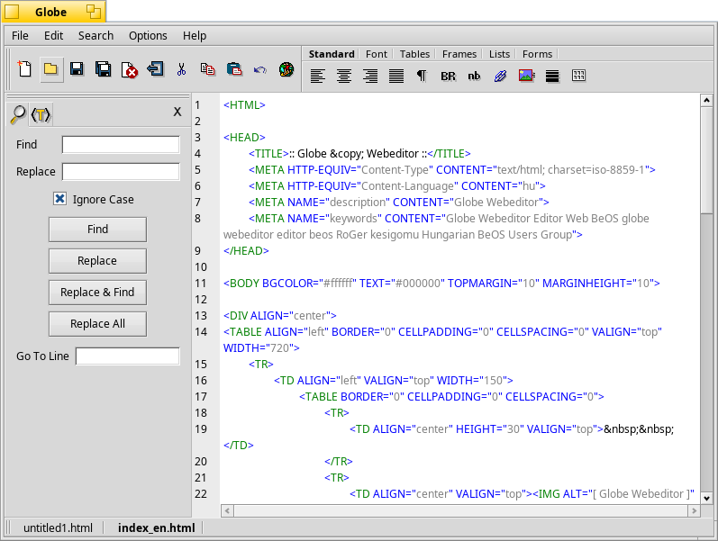

# Globe

Globe is an editor for web files designed for those who may not be completely familiar with programming.

Globe supports editing of both HTML and PHP files.

There is an online help website available in the directory `src/RHTML/reference`.

## Installation

To install Globe, run `make install` in this directory. Globe can then be launched from the terminal using the command `Globe`.

## Issues

Globe was originally written for BeOS. As such, there are a few issues. They can be viewed [here](https://github.com/HaikuArchives/Globe/issues).

## Screenshot

